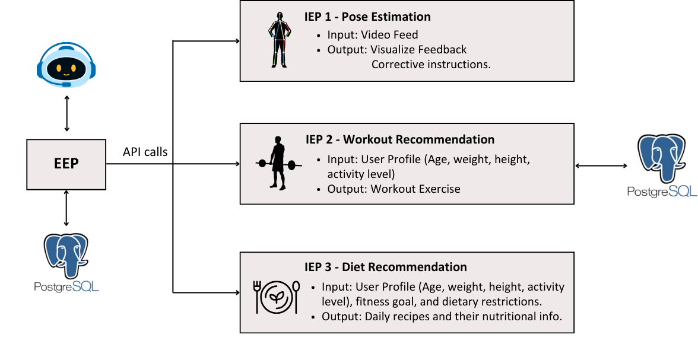

<h1 align="left">
  
  TrainMeAI
</h1>

**TrainMeAI** is an advanced AI-powered fitness platform designed to deliver personalized workout recommendations, real-time exercise form analysis, and intelligent meal planning. Leveraging state-of-the-art reinforcement learning, computer vision, and nutritional intelligence, TrainMeAI dynamically adapts to individual user needs—whether they are fitness novices or experienced athletes—offering a comprehensive and tailored approach to health and wellness.

**TrainMeAI** is an AI-powered fitness platform designed to deliver personalized workout recommendations, real-time exercise form analysis, and intelligent meal planning. By integrating reinforcement learning, computer vision, and machine learning, it continuously adapts to each user’s fitness level, goals, and preferences.

# Features

- Pose Estimation (IEP1): Real-time exercise form feedback using MediaPipe & OpenCV.
- Workout Recommendation (IEP2): Personalized multi-exercise workout plans using PPO-based reinforcement learning.
- Meal Planning (IEP3): Smart dietary suggestions and recipes uding content based filtering depending on users  needs.
- External Frontend (EEP): User-friendly Streamlit dashboard to interact with all AI services.
- GymBuddyAI Chatbot: Fitness chatbot powered by Hugging Face for Q&A, workout, and meal plan guidance.
- Monitoring: Prometheus & Grafana for live monitoring of AI service metrics.
- Cloud Deployed: Azure AKS (Kubernetes) and Azure Container Registry (ACR) for scalable deployment.

# Architecture

<div align= "center"></div>

# Application Setup

## Option 1: Run with Docker Compose

1- Clone the repo
```
$ git clone https://github.com/fatenchtay98/train-me-ai.git
```
cd Diet-Recommendation-System

2- In the project root run:
```
$ docker-compose up -d --build
```

3- Access the App
Open your browser and navigate to http://0.0.0.0:8501


## Option 2: Run EEP as a Standalone Server
(Recommended for testing real-time pose estimation)

1- Comment out EEP section in docker-compose.yaml

2- In the project root run:
```
streamlit run app.py                                                                        
```
3- Then open http://localhost:8501


## Option 3: Use the hosted version on Azure
9.163.209.67

# Deployment

The TrainMeAI platform was deployed using a containerized microservices architecture orchestrated via **Azure Kubernetes Service (AKS)**. This approach ensures scalability, modular development, and cloud-native reliability for each intelligent service component.

### Infrastructure Overview

- **Azure Kubernetes Service (AKS)** hosts and manages all backend IEPS and the frontend (EEP), ensuring high availability and scalability.
- **Azure Container Registry (ACR)** is used to store Docker images for all services.
- **Kubernetes manifests** define each service's deployment, including container images, resource limits, environment variables, and networking.


### CI/CD with GitHub Actions

- GitHub Actions is used to automate the deployment process:
  - On code push, Docker images are built and pushed to ACR
  - Kubernetes manifests are applied to update the AKS cluster
- This setup enables a smooth and consistent CI/CD workflow with zero-downtime updates

### Configuration and Secrets

- **Kubernetes Secrets** are used for secure storage of sensitive data such as database URLs and API keys.
- **ConfigMaps** store service-specific environment variables and runtime configurations.

### Monitoring and Observability

- **Prometheus** collects metrics from each IEP and the frontend.
- **Grafana** visualizes service performance, including:
  - Inference latency
  - Recommendation accuracy
  - API health and usage metrics

### Service Communication

- All services communicate via internal service names in AKS using `ClusterIP` networking.
- No direct communication occurs between AI modules—communication flows only through API requests initiated by the frontend (EEP).


# Resources
https://drive.google.com/drive/folders/1opgEii5W0dIYtCmPPjr66w7nCjJ_FWEl?q=sharedwith:public%20parent:1opgEii5W0dIYtCmPPjr66w7nCjJ_FWEl
---
